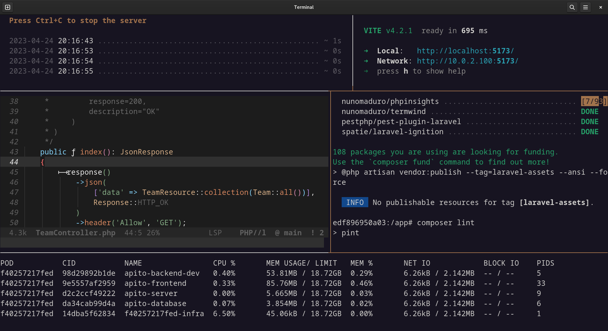

# Apito

Evaluate soccer referees' performance.

## Stack

| Framework |                                            |
| --------- | ------------------------------------------ |
| Symfony   | https://gitlab.com/easbarba/apito-symfony  |
| Laravel   | https://gitlab.com/easbarba/apito-laravel  |
| Vue.js    | https://gitlab.com/easbarba/apito-frontend |

## Terraform

Launch new EC2 instance with security group inbound rule limited to machine ip.

## [Ansible Playbook](ansible)

Connect to EC2 instance, install essential packages and provide Podman's configuration and start all containers.

## [Podman's Pod](https://developers.redhat.com/blog/2019/01/15/podman-managing-containers-pods)

`Apito`, as a lab project, is managed by Podman's pod, just like k8s pod it is grouped by a namespace, load-balancer, ports bindings... at will and all containers share a network as in the g'old native system.

## Cloud

- AWS EC2

# Continuous Development

- Gitlab CI

## Proxy

- NGINX reverse proxy

## Database

- PostgreSQL

## License

[GNU GENERAL PUBLIC LICENSE Version 3](https://www.gnu.org/licenses/gpl-3.0.en.html)

